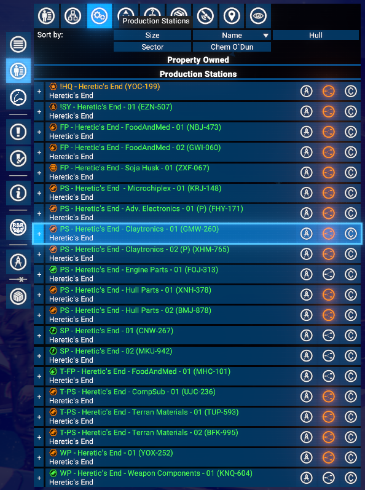
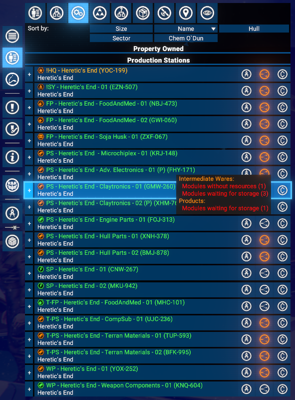
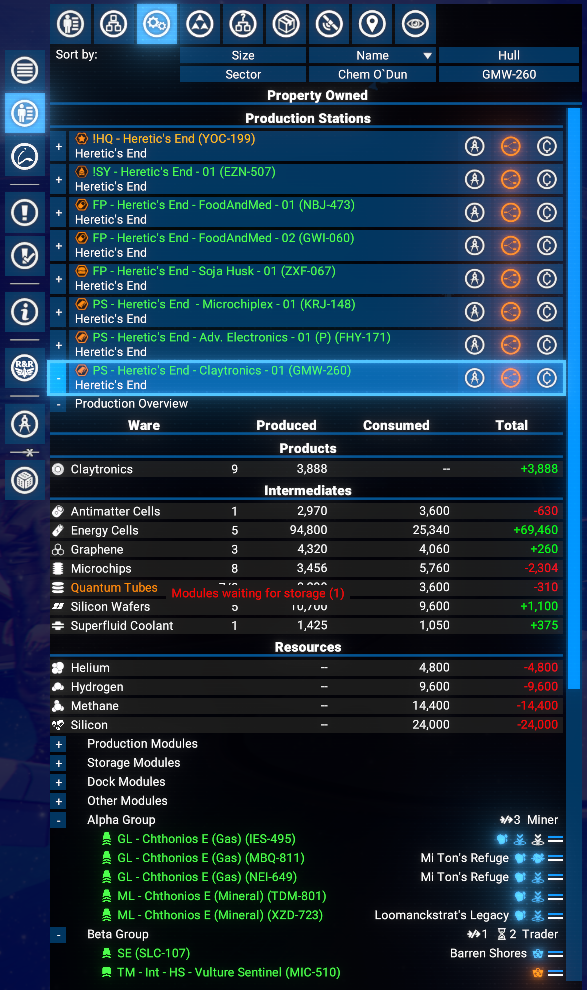

# Production Stations Tab

Adds a **Production Stations** tab to the **Property Owned** menu in the map (the fleet/property list alongside Ships, Stations, etc.). Lists all player-owned stations that have production modules, with per-station production data and quick-navigation buttons.

## Features

- **Production Stations Tab**: A dedicated tab in the Property Owned menu lists all player-owned stations that contain production or processing modules.
- **Station icon with issue indicator**: The station class icon is shown next to the station name and tinted in warning colour when any production module has an issue.
- **Production Overview sub-section**: Expand a station row, then open the collapsible Production Overview section to see per-ware produced, consumed, and net total amounts per hour.
- **Ware icons**: Each ware row shows the ware icon alongside its name for quick visual identification.
- **Production issue indicators**: If any production modules for a ware are waiting for resources or waiting for storage, the ware name is highlighted in warning colour and a mouseover tooltip lists the exact issue counts per state.
- **Active module count**: The module count column shows how many modules are currently running out of the total installed (e.g. `3/5`).
- **Ware grouping**: Wares are grouped into **Products** (not consumed on-site), **Intermediates** (produced and consumed on-site), and **Resources** (pure inputs, not produced on-site).
- **Logical Station Overview button**: Opens the Logical Station Overview for inventory and build plan details. Tinted in warning colour when the station has production issues.
- **Quick-navigation buttons**: *Configure Station* and *Transaction Log* buttons are available on each station row.

## Requirements

- **X4: Foundations**: Version **8.00** or higher.
- **UI Extensions and HUD**: Version 8.04 or higher by [kuertee](https://next.nexusmods.com/profile/kuertee?gameId=2659).
  - Available on Nexus Mods: [UI Extensions and HUD](https://www.nexusmods.com/x4foundations/mods/552)
- **Mod Support APIs**: Version 1.95 or higher by [SirNukes](https://next.nexusmods.com/profile/sirnukes?gameId=2659).
  - Available on Steam: [SirNukes Mod Support APIs](https://steamcommunity.com/sharedfiles/filedetails/?id=2042901274)
  - Available on Nexus Mods: [Mod Support APIs](https://www.nexusmods.com/x4foundations/mods/503)

## Installation

- **Steam Workshop**: [Station Production Overview](https://steamcommunity.com/sharedfiles/filedetails/?id=)
- **Nexus Mods**: [Station Production Overview](https://www.nexusmods.com/x4foundations/mods/2052)

## Usage

Open the map, switch to the **Property Owned** panel, and click the **Production Stations** tab in the tab strip.

All player-owned stations that contain at least one production or processing module are listed. Each row shows the station name, sector, and three action buttons on the right side.

To see per-ware production data, expand a station row with the **+** button, then expand the **Production Overview** sub-section.

### Station row

Each station row contains:

- **+/-** expand button on the left to reveal modules, subordinate ships, docked ships, and the Production Overview sub-section.
- Station class icon (tinted warning colour if any production module has an issue) and the station name with sector underneath with a tooltip showing the possible production issues.
- **Configure Station** button - opens the Station Configuration menu.
- **Logical Station Overview** button - opens the Logical Station Overview (tinted warning colour when the station has production issues).
- **Transaction Log** button - opens the Transaction Log for this station.

### Production Overview sub-section

After expanding a station row, a collapsible **Production Overview** sub-section appears before the module list. Opening it shows a table with one row per ware:

- **Ware**: icon and name (highlighted in warning colour if there are production issues), with module count (`active/total`) on the right.
- **Produced**: amount produced per hour.
- **Consumed**: amount consumed per hour.
- **Total**: net amount per hour.

Wares are grouped into **Products**, **Intermediates**, and **Resources**.

## Credits

- **Author**: Chem O`Dun, on [Nexus Mods](https://next.nexusmods.com/profile/ChemODun/mods?gameId=2659) and [Steam Workshop](https://steamcommunity.com/id/chemodun/myworkshopfiles/?appid=392160)
- *"X4: Foundations"* is a trademark of [Egosoft](https://www.egosoft.com).

## Acknowledgements

- [EGOSOFT](https://www.egosoft.com) - for the X series.
- [kuertee](https://next.nexusmods.com/profile/kuertee?gameId=2659) - for the `UI Extensions and HUD` that makes this extension possible.
- [SirNukes](https://next.nexusmods.com/profile/sirnukes?gameId=2659) - for the `Mod Support APIs` that power the UI hooks.

## Changelog

### [8.00.01] - 2026-04-01

- **Added**
  - Initial public version
